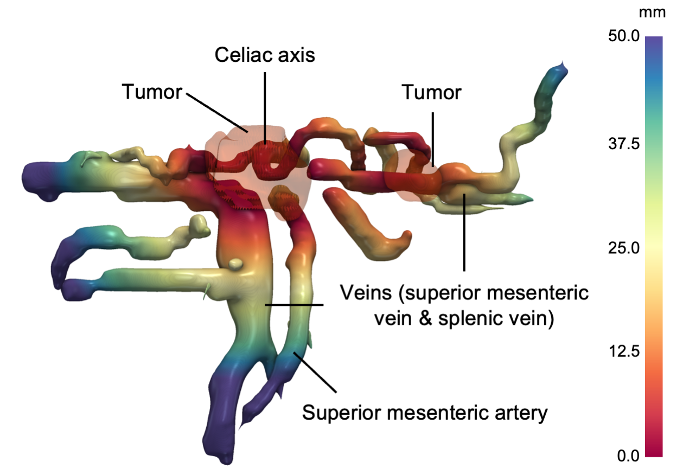

# PanVasc
PanVasc: A Shape-Aware Framework for Peripancreatic Vascular Invasion Assessment in Pancreatic Ductal Adenocarcinoma

## What is PanVasc?
PanVasc is a shape-based framework that converts the segmented tumor and peripancreatic vessels into explicit, quantitative descriptions of their spatial relationship. Our contributions are threefold: 
1. First, we render a 3D tumor-proximity map i.e., the vessel surface colored by distance to the nearest tumor-surface point. This provides a clinician with an immediate, view-independent picture of where each vessel is in contact with or in proximity to the tumor.
2. Second, we reduce this surface field to an encasement profile. We represent the circumferential angle of tumor contact as a continuous function of tumor position along each vessel or vascular branch. This is computed on the true vessel surface using a rotation-minimizing frame and explicit handling of vascular branching.
3. Third, we summarize each profile by the area under the encasement curve and peak encasement angle, two scalars that capture how much of the vessel is contacted and how tightly. This provides candidate interpretable preoperative markers to support surgical planning.

  

